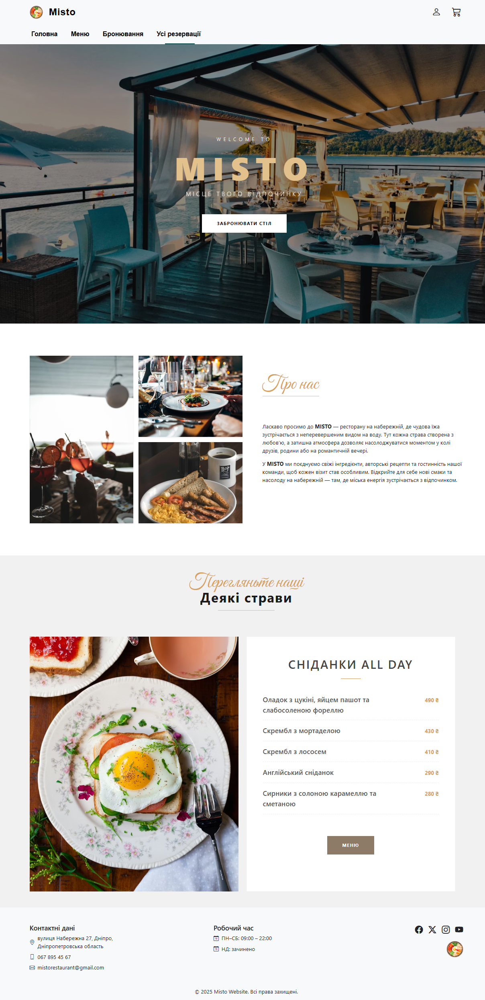
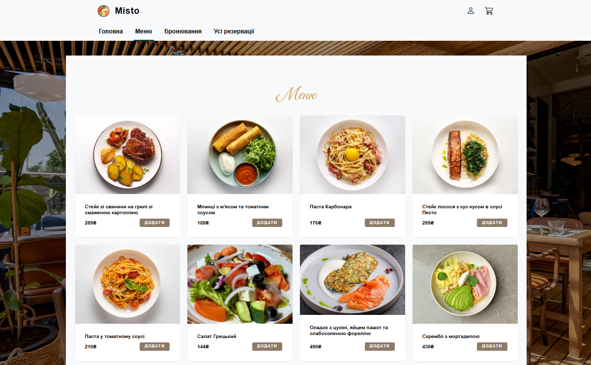
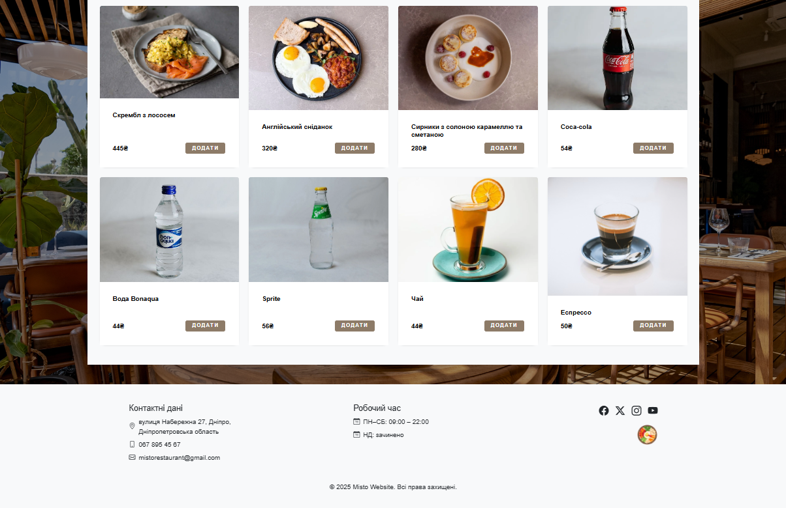
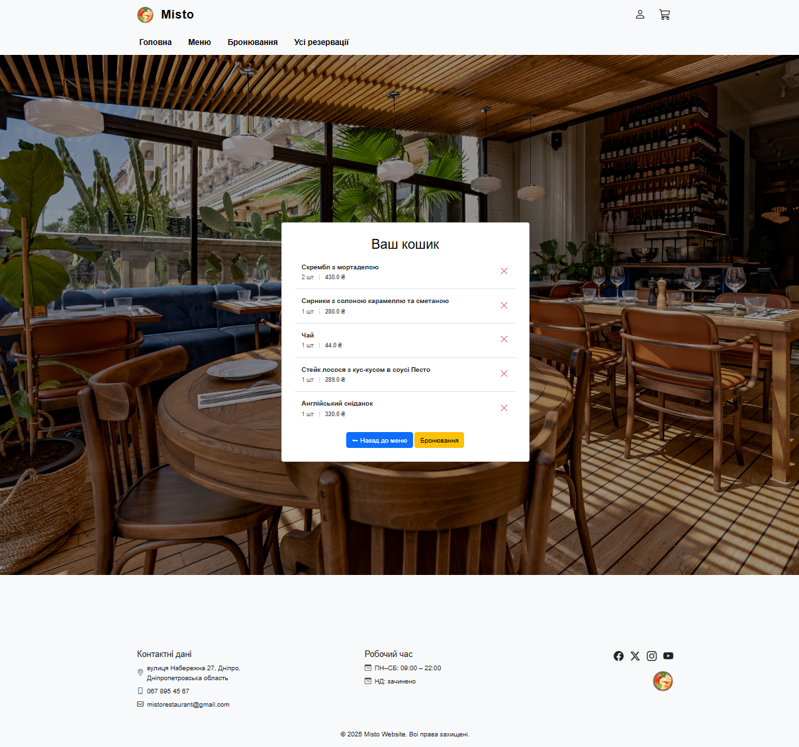
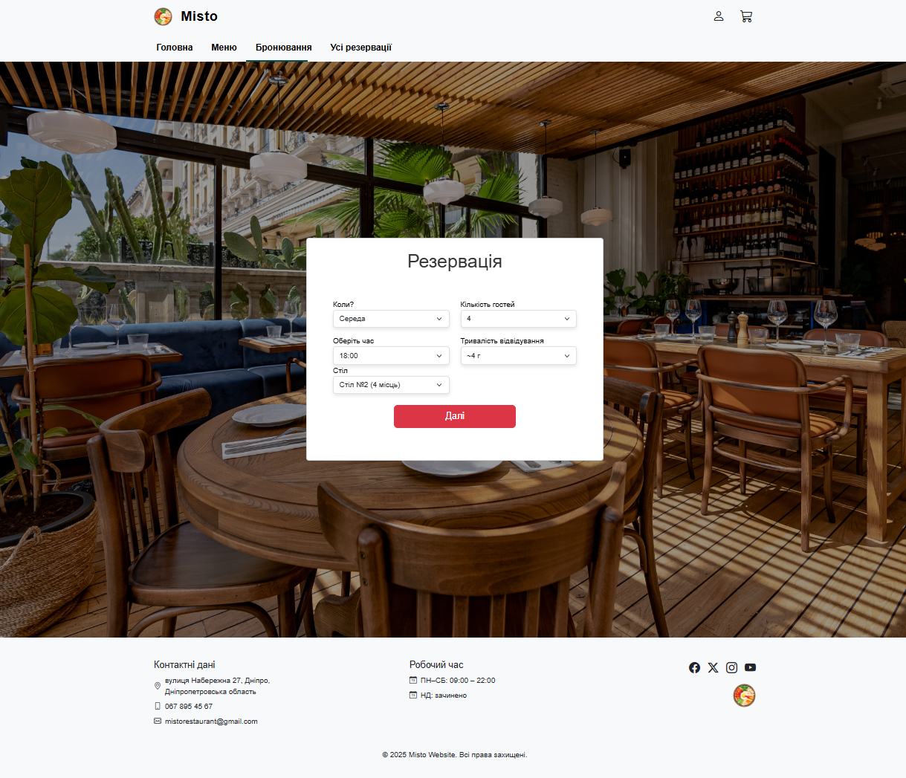
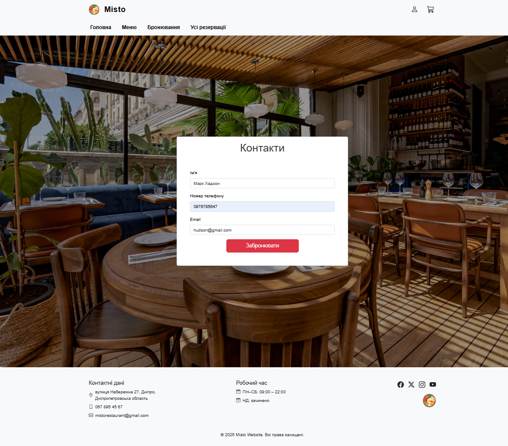
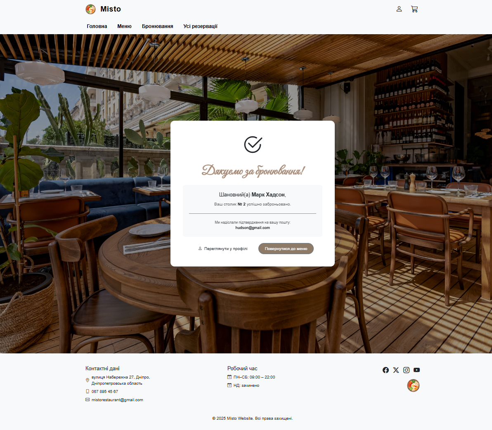
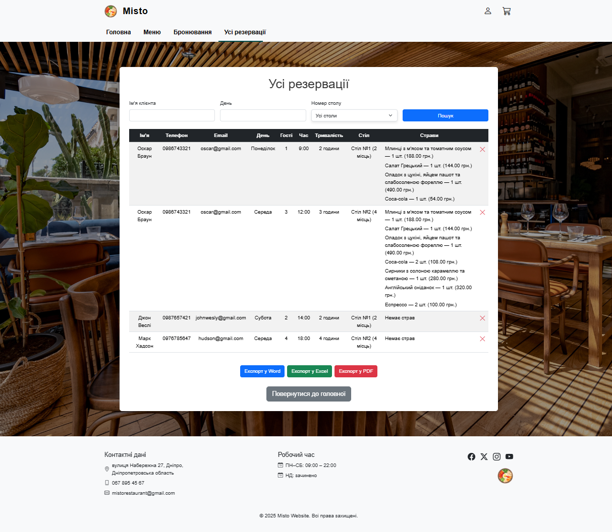
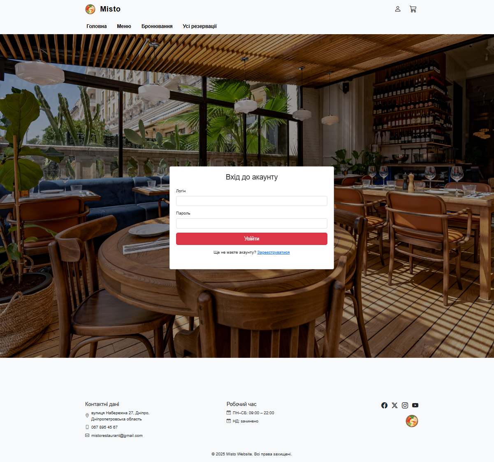
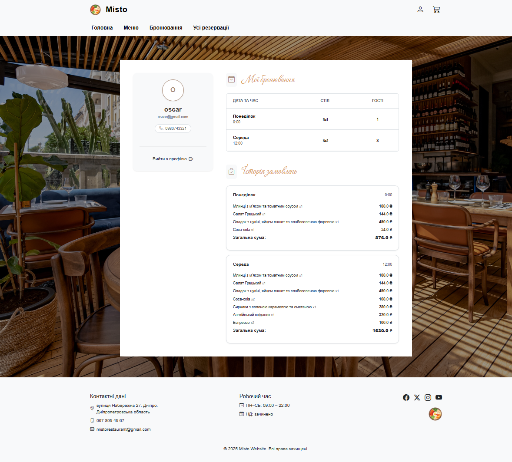

# 🍽️ Online Restaurant Reservation System <br>  
This project is a web-based restaurant reservation system that allows users to book tables, browse the menu, place orders, and manage their profile online.
It also includes an admin panel for managing reservations and orders with export functionality.

# 📋 Features
Table Reservation: Choose date, time, table, add contact information. <br>
Menu & Ordering: Add items to cart and reserve with order. <br>
User Accounts: Register, login, authorize. <br>
Admin Panel: Access via admin authentication to manage all reservations—view, <br> add, delete and filter by customer name, date or table number—and export data to PDF, Excel or Word. <br>
User Profile: Accessible only to the user; view all personal reservations, including tables and ordered dishes.

# 🔧 Tech Stack
**Backend:**  Python, Flask <br>
**Database:** SQLite <br>
**Frontend:** HTML, CSS, Bootstrap, JavaScript <br>
**Templating:** Jinja2 <br>

# 🖼️ Screenshots
The screenshots above demonstrate the main pages and functionality of the online restaurant reservation system. All pages are built with Django templates, Bootstrap, and custom CSS, with data loaded dynamically from a SQLite database. Users can register, login, view their profile with all table and dish reservations, add menu items to the cart and make reservations. The admin panel, accessible via admin authentication, allows managing all reservations, adding or deleting orders, filtering by customer name, date, or table number, and exporting data to PDF, Excel, or Word.

## 🏠 Home Page
<p align="center">

</p>

## 📋 Menu Page
<p align="center">


</p>

## 🛒 Cart
<p align="center">

</p>

## 🗓️ Booking Pages
<p align="center">


</p>
<br>
<p align="center">

</p>

## 🛠️ Admin Panel
<p align="center">

</p>

## 🔐 Authorization
<p align="center">

</p>

## 👤 User Profile
<p align="center">

</p>

# 🚀 How to Run Locally
## 1️⃣ Clone the repository
```
git clone https://github.com/Shyshkanova2005/Online-Restaurant-Reservation.git
cd Online-Restaurant-Reservation
```

## 2️⃣ Install dependencies
```
pip install -r requirements.txt
```

## 3️⃣ Configure environment variables
Create a .env file (or set environment variables manually) and add:
```
SECRET_KEY=
```
The SECRET_KEY is not included in the repository for security reasons.

## 4️⃣ Run the development server
```
python app.py
```
